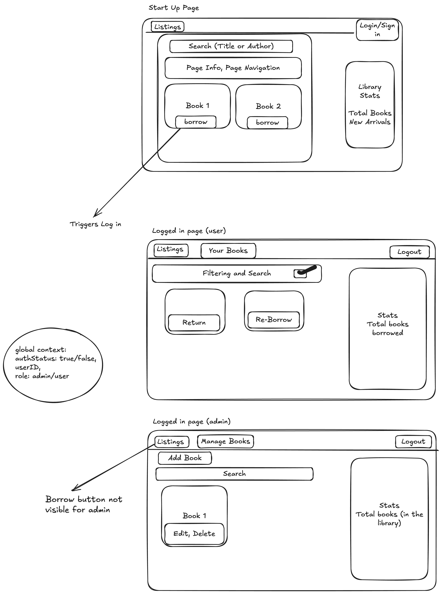

# Library Management System

This repository contains the Library Management System project, a full-stack application built as an assignment for String Ventures' Full Stack Developer Intern role. The system offers both user and admin functionalities to manage library operations seamlessly. It is structured into two main parts:

1. **Frontend**
   - Built using **React**, **Vite**, and **ShadCN UI**.
   - Provides a ***responsive UI*** for users and admins to interact with the library system.
   - ***Detailed README.MD within frontend folder.***

2. **Backend**
   - Built using **Node.js** and **Express.js**.
   - Exposes RESTful APIs for managing users, books, and transactions.
   - Integrates with **MongoDB** and **Cloudinary** for data storage and file uploads, respectively.
   - ***Detailed README.MD within backend folder.***
---

## Features

- **Role-Based Authentication**:
  - Users can borrow and return books.
  - Admins can manage books (CRUD operations).
- **Search and Filtering**:
  - Search books by title or author.
  - Filter books by availability.
- **Dashboard Statistics**:
  - Admins can view statistics such as total books, borrowed books, and available books.
- **File Uploads**:
  - Secure thumbnail uploads using **Cloudinary**.
- **Scalable Backend**:
  - Built with **Express.js** and **Mongoose** for scalability and ease of maintenance.

---

## Project Structure
```
Library-Management-System/
├── frontend/             # Frontend code
...
│   └── README.md         # Frontend-specific documentation
├── backend/              # Backend code
...
│   └── README.md         # Backend-specific documentation
└── README.md             # Overall project documentation
```

---

## Setup Instructions

### Frontend
To set up the frontend, refer to the `frontend/README.md` file for detailed installation and deployment instructions.

### Backend
To set up the backend, refer to the `backend/README.md` file for detailed installation and deployment instructions.

---

## Rough UI Sketch
Below is a rough sketch of the UI design for the application:



### Features Highlighted in the Sketch:
- **Start-Up Page**:
  - Search books by title or author.
  - View library statistics such as total books and new arrivals.
  - Login/sign-up option.
- **User Dashboard**:
  - Borrow or return books.
  - View borrowed books.
  - Library statistics showing total books borrowed.
- **Admin Dashboard**:
  - Manage books (add, edit, delete).
  - Library statistics showing total books in the library.

---

## Entity Relationship Diagram (ERD)
The ER diagram for the database structure is available via [Eraser Link](https://app.eraser.io/workspace/XbBNR6FZdnz3IklpfIVy?origin=share).

### Database Entities
- **Users**:
  - Admins and regular users.
- **Books**:
  - Title, author, description, publication year, quantity, and thumbnail.
- **Transactions**:
  - Tracks borrowed and returned books.

---

## API Documentation
The backend API documentation is available in the Postman collection, which can be accessed [here](https://assignment-for-reunion.postman.co/workspace/Testing~aaf2b6b1-3c13-4577-8668-62cf66db8a32/collection/32695735-b18f4bb8-7fbf-46d9-81df-25d6bdf973cd?action=share&source=collection_link&creator=32695735).

Alternatively, you can find the API documentation in `backend/latest_api_doc.json`.

---

## Deployment

### Frontend
- Deployed on **Vercel**.
- Accessible at: [Frontend Deployment URL](https://library-management-string-ventures.vercel.app)

### Backend
- Deployed on **Vercel**.
- Endpoint starts with: `<https://library-management-string-ventures-mryt.vercel.app/api/>`


